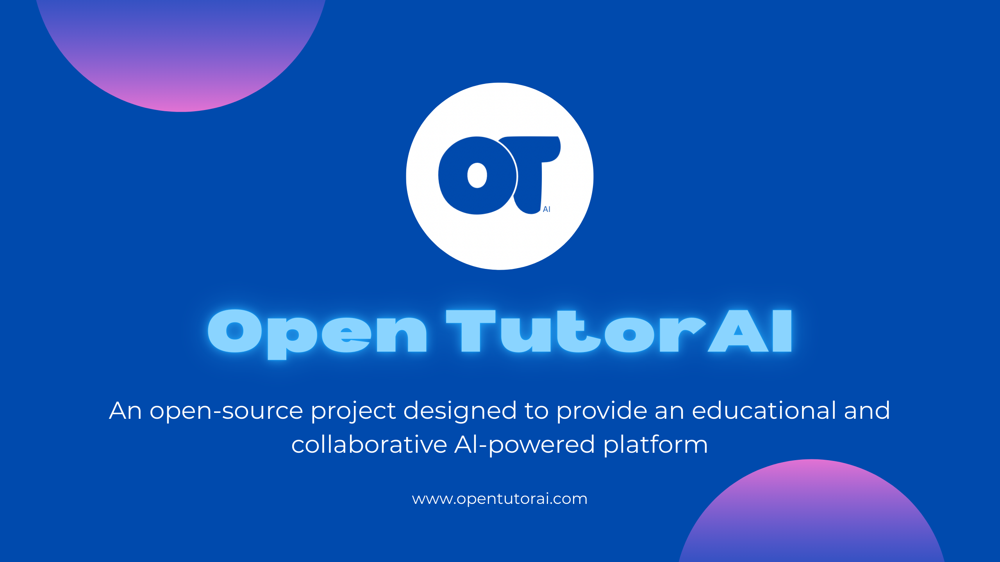
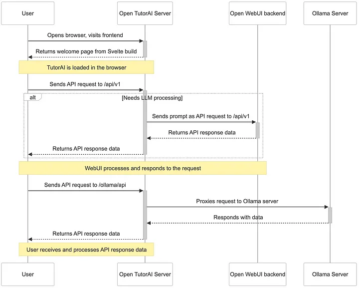

Artificial intelligence is transforming how we learn — and **Open TutorAI Community Edition** is leading the way.  
This open-source platform empowers educators, developers, and AI enthusiasts to create **personalized**, **collaborative**, and **self-hosted** learning environments powered by large language models.

As shown in the figure below, built on top of **Open WebUI**, Open TutorAI offers all the tools you need to launch quickly and scale with ease.




Open TutorAI: More Than Just a Chat Interface. It’s a **fully-featured educational ecosystem** built to grow with your learning goals.


### API Compatibility with OpenAI & Ollama

Out-of-the-box support for OpenAI-compatible APIs — connect to:

- **LMStudio**
- **Mistral**
- **GroqCloud**
- **OpenRouter**
- Or use your own local **Ollama** models


### Granular Permissions & Secure Access

Use **role-based permissions** to control who can access what — perfect for:

- Classrooms  
- Teams  
- Research groups


### Built for Learning

Designed specifically for education:

-  Personalize tutoring support  
-  Generate custom LLMs with tailored avatars  
-  Load course materials, lecture notes, and assignments directly into chat  

Empower learners with:

-  **Retrieval-Augmented Generation (RAG)** for document-based answers  
-  **Voice**,  **Video**, &  **Avatar Chat Modes**: Communicate in a more immersive and interactive way  


### Getting Started: Local Installation Guide

#### 🐳 Easy Setup with Docker

Spin up your environment in minutes using prebuilt Docker images (`:ollama`, `:cuda`) for **local** or **cloud** deployment.


#### 1. Fork and Clone the Repository

Visit the GitHub repository:  
🔗 [Open TutorAI repository](https://github.com/Open-TutorAi/open-tutor-ai-CE)

Then fork and clone your version:

```bash
git clone https://github.com/YOUR_USERNAME/open-tutor-ai-CE.git
cd open-tutor-ai-CE
```

#### 2. Set Up the Backend

```bash
cd backend
conda create -n tutorai-env python=3.11
conda activate tutorai-env
pip install -r requirements.txt
./dev.sh  # for development
# or
./start.sh  # for production
```

#### 3. Set Up the Frontend

```bash
npm install
npm run dev
```

For full documentation and troubleshooting, visit:  
📖 **[Open TutorAI Docs](https://opentutorai.com/docs/intro)**


### Join the Community

Join our active community on **Discord** to:

- Ask questions  
- Share your ideas  
- Explore and build custom models

🔗 **[Open TutorAI Discord](https://discord.gg/BTQtE2deEm)**  

Also explore the **Open TutorAI Community** project for advanced customization and contributions.


### What’s Coming Next?

We’re just getting started!

Check out our [**roadmap**](https://opentutorai.com/docs/roadmap) to see what’s in development — and don’t hesitate to **get involved** or **suggest features**!
